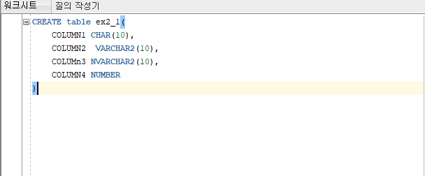

# 2장 데이터베이스를 구성하는 객체 살펴 보기

## 1 데이터베이스 객체의 개요
- 데이터베이스 객체란 데이터베이스 내에 존재하는 논리적인 저장 구조를 말한다

### 데이터베이스 객체의 종류
|데이터베이스 객체|설명|
|--|--|
|테이블|데이터를 담고 있는 개체|
|뷰|하나 이상의 테이블을 연결해 마치 테이블인 것처럼 사용하는 객체|
|인덱스|테이블에 있는 데이터를 빠르게 찾기 위한 객체|
|시노님|데이터베이스 객체에 대한 별칭을 부여한 객체|
|시퀀스|일련번호 채번을 할 때 사용되는 객체|
|함수|특정 연산을 하고 값을 반환하는 객체|
|프로시저|함수와 비슷하지만 값을 반환하지는 않는 객체|
|패키지|용도에 맞게 함수나 프로시저를 하나로 묶어 놓은 객체|

## 2 테이블
- 데이터를 담고 있는 객체

### 테이블 생성
```sql
CREATE TABLE [스키마.]테이블명(
    컬럼1 컬럼1_데이터타입 [NULL,NOT NULL],
    컬럼2 컬럼2_데이터타입 [NULL,NOT NULL],
    ...
)[TABLESPACE 테이블스페이스명];
```



- 테이블명과 컬럼명의 규칙
1. 테이블명, 컬럼명의 최대 크기는 30바이트이다.
2. 테이블명, 컬럼명으로 예약어는 사용할 수 없다.
3. 테이ㅡㄹ명,컬럼명으로 문자,숫자,'_','$','#'을 사용할 수 있지만, 첫 글자는 문자만 올 수 있다.
4. 한 테이블에 사용 가능한 컬럼은 최대 255개까지이다.

### 데이터 타입
#### 문자 데이터 타입

|데이터 타입|설명|
|--|--|
|CHAR(크기[BYTE/CHAR])|고정길이 문자, 최대 2000byte, 디폴트 값은 1byte|
|VARCARCHAR2(크기[BYTE/CHAR])|가변길이 문자, 최대 4000byte, 디폴트 값은 1byte|
|NCHAR(크기)|고정길이 유니코드 문자(다국어 입력 가능), 최대 2000byte, 디폴트 값은 1|
|NVARCARCHAR2(크기)|가변길이 유니코드 문자(다국어 입력 가능), 최대 4000byte, 디폴트 값은 1|
|LONG|최대 2GB 크기의 가변길이 문자형, 잘 사용하지 않음|

- 더이상 LONG은 권장되지 않으며 CLOB,BLOB으로 대체할 수 있다.
- 영어는 한 문자를 1byte,한글은 한 문자를 2byte로 취급한다.

#### 숫자 데이터
|데이터 타입|설명|
|--|--|
|NUMBER [(p,[s])]|가변숫자,p(1~38, 디폴트는 38)과 s(-84~127, 디폴트 값은 0) 는 십진수 기준, 최대 22byte|
|FLOAT[(p)]|NUMBER의 하위 타입, p는 1~128, 디폴트 값은 128, 이진수 기준, 최대 22byte|
|BINARY_FLOAT|32비트 부동소수점 수, 최대 4byte|
|BINARY_DOUBLE|64비트 부동소수점 수, 최대 8byte|

- NUMBER형만 사용할 때가 많다.

- p(precision)와 s(scale)의 정의 및 규칙
    1. p는 소수점 기준 모든 유효숫자 자릿수를 의미한다. 만약 p에 명시한 것보다 큰 숫자값을 입력하면 오류가 발생한다.
    2. s가 양수면 소수점 이하, 음수이면 소수점 이상(소수점 기준 왼쪽) 유효숫자 자릿수를 가진다.
    3. s에 명시한 숫자 이상의 숫자를 입력하면 s에 명시한 숫자로 반올림 처리한다.
    4. s가 음수이면 소수점 기준 왼쪽 자릿수만큼 반올림한다.
    5. s가 p보다 크면 p는 소수점 이하 유효숫자 자릿수를 의미한다.

#### 날짜 데이터 타입
|데이터 타입|설명|
|---|---|
|DATE|BC 4712년 1월 1일부터 9999년 12월 31일, 연,월,일,시,분,초까지 입력가능하다.|
|TIMESTAMP[(fractional_seconds_precision)]|연도 ,월, 일, 시,분 ,초는 물론 밀리초까지 입력 가능하다 fractional_seconds_precision은 0~9까지 입력가능하고 디폴트 값은 6이다.|

#### LOB데이터 타입
|데이터 타입|설명|
|---|---|
|CLOB|문자형 대용량 객체, 고정길이와 가변길이 문자 집합 지원, 최대 크기는 (4GB-1) * (데이터베이스 블록 사이즈)|
|NCLOB|유니코드(다국어 지원)를 포함한 문자형 대용량 객체. 최대 크기는 (4GB-1) * (데이터베이스 블록 사이즈)|
|BLOB|이진형 대용량 객체. 최대 크기는(4GB-1) * (데이터베이스 블록 사이즈)|
|BFILE|대용량 이진 파일에 대한 로케이터(위치,이름) 저장. 최대 크기는 4GB|

#### NULL
- 값이 없음

#### 제약조건
- 제약 조건 역시 엄연한 오라클 데이터베이스 객체 중 하나이다.
1. NOT NULL
```sql
컬럼명 데이터타입 NOT NULL
```

2. UNIQUE
```sql
컬럼명 데이터타입 UNIQUE
혹은
CONSTRAINTS 제약조건명 UNIQUE(컬럼명,...)
```
- UNIQUE 비교 대상에서 NULL은 제외된다.

#### 기본키(PRIMARY KEY)
- UNIQUE와 NOT NULL 속성을 동시에 가지는 제약 조건
- 테이블 당 1개의 기본키만 생성 가능

```sql
컬럼명 데이터타입 PRIMARY KEY
혹은
CONSTRAINTS 제약조건명 PRIMARY KEY(컬럼명, ...)
```

#### 외래키(FOREIGN KEY)
- 테이블 간의 참조 데이터 무결성을 위한 제약조건
```sql
CONSTRAINT 외래키명 FOREIGN KEY(컬럼명, ...)
REFERENCES 참조 테이블(참조 테이블 컬럼명, ...)
```

- 외래키에 대한 제약 사항
    1. 반드시 참조하는 테이블이 먼저 생성되어야 하며, 참조키가 참조 테이블의 기본키로 만들어져 있어야 한다.
    2. 외래키에 사용할 수 있는 컬럼 개수는 최대 32개이다.
    3. 여러 컬럼을 위래키로 만들려면, 참조하는 컬럼과 외래키 컬럼의 순서와 갯수는 같아야 한다.

#### CHECK
- 컬럼에 입력되는 데이터를 체크해 특정 조건에 맞는 데이터만 입력 받고 그렇지 않으면 오류를 뱉어 낸다.
```sql
CONSTRAINT 체크명 CHECK(체크 조건)
```

#### DEFAULT
- 제약 조건은 아니나 컬럼 속성 중 하나로 DEFAULT가 있다. 컬럼의 DEFAULT 값을 명시하는데 사용

### 테이블 삭제

```sql
DROP TABLE [스키마.]테이블명 [CASCADE CONSTRAINTS]
```

### 테이블 변경
1. 컬럼명 변경
```sql
ALTER  TABLE [스키마.]테이블명 RENAME COLUMN 변경전컬럼명 TO 변경후컬럼명;
```

2. 컬럼 타입 변경
```sql
ALTER TABLE [스키마.]테이블명 MODIFY 컬럼명 데이터타입;
```

3. 컬럼 추가
```sql
ALTER TABLE [스키마.]테이블명 ADD 컬럼명 데이터타입;
```

4. 컬럼 삭제
```sql
ALTER TABLE[스키마.]테이블ㄹ명 DROP COLUMN 컬럼명;
```

5. 제약 조건 추가(기본키추가)
```sql
ALTER TABLE [스키마.]테이블명 ADD CONSTRAINTS 제약조건명 PRIMARY KEY(컬럼명, ...);
```

6. 제약 조건 삭제 : 기본키 삭제
```sql
ALTER TABLE[스키마.]테이블명 DROP CONSTRAINTS 제약조건명;
```

### 테이블 복사
```sql
CREATE TABLE [스키마.]테이블명 AS
SELECT 컬럼1, 컬럼2, ...
FROM 복사할 테이블명;
```

## 3 뷰
- 하나 이상의 테이블이나 다른 뷰의 데이터를 볼 수 있게 하는 데이터베이스 객체
- 데이터를 본다는 의미가 있으므로 뷰의 정의는 데이터를 조회하는 SELECT문으로 구성된다.

### 뷰 생성
```sql
CREATE OR REPLACE VIEW[스키마.]뷰명 AS
SELECT 문장;
```

### 뷰 삭제
```sql
DROP VIEW [스키마.]뷰명;
```

## 4 인덱스
- 테이블에 있는 데이터를 빨리 찾기 위한 용도의 데이터베이스 객체
- 특성에 따른 대표적 분류
    1. 인덱스 구성 컬럼 개수에 따른 분류 : 단일 인덱스 ,결합 인덱스
    2. 유일성 여부에 따른 분류 : UNIQUE 인덱스, NON-UNIQUE 인덱스
    3. 인덱스 내부 구조에 따른 분류 : B-tree 인덱스, 비트맵 인덱스, 함수 기반 인덱스

### 인덱스 생성
```sql
CREATE [UNIQUE] INDEX [스키마명.]인덱스명
ON [스키마명.]테이블명(컬럼1,컬럼2,...);
```
- 인덱스 생성에 고려해야할 사항
    1. 일반적으로 테이블 전체 로우 수의 15%이하의 데이터를 조회할 때 인덱스를 생성한다.
    2. 테이블 건수가 적다면 굳이 인덱스를 만들 필요가 없다.
    3. 데이터의 유일성 정도가 좋거나 범위가 넓은 값을 가진 컬럼을 인덱스로 만드는 것이 좋다.
    4. NULL이 많이 포함된 컬럼은 인덱스 컬럼으로 만들기 적당치 않다.
    5. 결합 인덱스를 만들 때는 컬럼의 순서가 중요하다
        - 보통, 자주 사용되는 컬럼을 순서상 앞에 두는 것이 좋다.
    6. 테이블에 만들 수 있는 인덱스으 ㅣ수의 제한은 없으나, 너무 많이 만들면 오히려 성능 부하가 발생한다.

### 인덱스 삭제
```sql
DROP INDEX [스키마명.]인덱스명;
```
