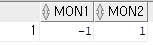

# SQL 함수 살펴 보기

## 01 숫자 함수

1. ABS(n)
    - 매개변수를 숫자로 받아 그 절대값을 반환
2. CEIL(n), FLOOR(n)
    - CEIL은 매개변수와 같거나 가장 큰 정수를 반환
    - FLOOR은 매개변수보다 작거나 가장 큰 정수를 반환
3. ROUND(n,i)와 TRUNC(n1,n2)
    - ROUND는 매개변수 n을 소수점 기준 (i+1)번 째에서 반올림한 결과 반환
    - TRUNC는 n1을 소수점 기준 n2자리에서 무조건 잘라낸 결과를 반환
4. POWER(n2,n1)와 SQRT(n)
    - POWER는 n2를 n1 제곱한 결과 반환
        -  n2가 음수일 때는 n1은 반드시 정수
    - SQRT 함수는 n의 제곱근을 반환
5. MOD(n2,n1)와 REMAINDER(n2,n1)
    - MOD 함수는 n2를 n1으로 나눈 나머지 값을 반환
    - REMAINDER 역시 n2를 n1으로 나눈 나머지 값을 반환하지만 내부적 여산 방법이 MOD와 다르다
6. EXP(n), LN(n) 그리고 LOG(n2,n1)
    - EXP는 지수 로그 함수로 e의 n제곱 값을 반환
    - LN은 자연 로그 함수로 밑수가 e인 로그 함수
    - LOG는 n2를 밑수로 하는 n1의 로그 값을 반환

## 02 문자 함수

1. INITCAP(char),LOWER(char),UPPER(char)
    - INITCAP 함수는 매개변수로 들어오는 char의 첫 문자를 대문자로 나머지는 소문자로 반환
    - LOWER는 모두 소문자, UPPer는 모두 대문자

2. CONCAT(char1,char2), SUBSTR(char,pos,len), SUBSTRB(char,pos,len)
    - CONCAT은 매개변수로 들어오는 두 문자를 붙여 반환
    - SUBSTR은 char를 pos번째 문자부터 len길이 만큼 잘라낸 결과를 반환
    - SUBSTRB는 문자 개수가 아닌 문자열의 바이트 수만큼 잘라낸 결과를 반환

3. LTRIM(char,set), RTRIM(char,set)
    - LTRIM은 char 문자열에서 set으로 지정된 문자열을 왼쪽 끝에서 제거한 후 나머지 문자열을 반환
    - RTRIM은 char 오른 쪽 끝에서 제거한 후 나머지 문자열을 반환
    - set을 생략하면 기본적으로 빈 공백 문자 한 글자가 사용

4. LPAD(expr1, n, expr2), RPAD(expr1, n, expr2)
    - LPAD 함수는 매개변수로 들어온 expr2 문자열을 n자리만큼 왼쪽 부터 채워 expr1을 반환하는 함수
    - n은 expr2와 expr1이 합쳐서 반환되는 총 자릿수를 의미
    - 서울의 지역 번호를 넣는 예시
    ```sql
    create table ex4_1(
    phone_num VARCHAR2(30)
    );

    SELECT LPAD(phone_num,12,'(02)')AS "서울지역번호" FROM ex4_1 ;
    ```

5. REPLACE(char,search_str,replace_str), TRANSLATE(expr,from_str,to_str)
    - REPLACE 함수는 char 문자열에서 search_str 문자열을 찾아 replace_str로 대체된 결과를 반환
    - TRANSLATE 함수는 REPLACE와 유사하다. expr 문자열에서 from_str에 해당하는 문자를 찾아 to_str로 바꾼 결과를 반환한다.
        - REPLCE와 다른 점은 문자열 자체가 아닌 문자 한 글자씩 매핑해 바꾼 결과를 반환한다.
        ex)
        ```sql
        SELECT REPLACE('나는 너를 모르는데 너는 나를 알겠는가?','나는','너를') AS rep,
            TRANSLATE('나는 너를 모르는데 너는 나를 알겠는가?','나는','너를') AS trn
        from dual;
        ```
        

6. INSTR(str, substr, pos, occur), LENGTH(chr), LENGTHB(chr)
    - INSTR 함수는 str 문자열에서 substr과 일치하는 위치를 반환하는데, pos는 시작 위치(디폴트는 1), occur은 몇 번째 일치하는지를 명시(디폴트는 1)
    ```sql
    SELECT INSTR('내가 만약 외로울 때면, 내가 만약 괴로울 때면, 내가 만약 즐거울 때면','만약') AS INSTR1,
        INSTR('내가 만약 외로울 때면, 내가 만약 괴로울 때면, 내가 만약 즐거울 때면','만약',5) AS INSTR2,
        INSTR('내가 만약 외로울 때면, 내가 만약 괴로울 때면, 내가 만약 즐거울 때면','만약',5,2) AS INSTR3
        FROM DUAL;
    ```
    

    - LENGTH 함수는 매개변수로 들어온 문자열의 개수를 반환
    - LENGTHB 함수는 해당 문자열의 바이트 수를 반환

## 03 날짜 함수
1. SYSDATE, SYSTIMESTAMP
- 각각 현재일자와 시간을 DATE,TIMESTAMP형으로 반환

2. ADD_MONTHS(date,integer)
- 매개변수로 들어온 날짜에 integer 만큼의 월을 더한 날짜를 반환
```sql
SELECT ADD_MONTHS(SYSDATE,1), ADD_MONTHS(SYSDATE,-1) FROM DUAL;
```

3. MONTHS_BETWEEN(date1,date2)
- 두 날짜 사이의 개월 수를 반환
- date2가 date1보다 빠른 날짜가 온다
```sql
SELECT MONTHS_BETWEEN(SYSDATE,ADD_MONTHS(SYSDATE,1)) mon1,
        MONTHS_BETWEEN(ADD_MONTHS(SYSDATE,1),SYSDATE) mon2
        FROM DUAL;
```


4. LAST_DAY(date)
- date 날짜를 기준으로 해당 월의 마지막 일자를 반환
```sql
SELECT LAST_DAY(ADD_MONTHS(SYSDATE,+10)) FROM DUAL;
```

5. ROUND(date,format), TRUNC(date,format)
- ROUND는 format에 따라 반올림한 날짜를 TRUNC는 잘라낸 날짜를 반환한다
```sql
SELECT SYSDATE,ROUND(SYSDATE,'month'),TRUNC(SYSDATE,'month') FROM DUAL;
```


6. NEXT_DAY(date,char)
- date를 char에 명시한 날짜로 다음 주 주중 일자를 반환
- NLS_LANG이란 오라클 환경 변수에 따라 한글이 올 수도, 영어가 올 수도 있다.
```sql
SELECT NEXT_DAY(SYSDATE,'월요일'),NEXT_DAY(SYSDATE,'일요일'),NEXT_DAY(SYSDATE,'목요일'),NEXT_DAY(SYSDATE,'금요일') FROM DUAL;
```


## 4 변환 함수
- 서로 다른 유형의 데이터 타입으로 변환해 결과를 반환하는 함수
- 변환 함수를 통해 형변화를 직접 처리하는 것을 명시적 형변환이라고 한다.

1. TO_CHAR(숫자 혹은 날짜,format)
- 주로 사용하는 포맷
    - 날짜 변환 시

    |포맷|설명|
    |--|--|
    |AM, A.M.|오전|
    |PM,P.M.|오후|
    |YYYY,YYY,YY,Y|연도|
    |MONTH,MON|월|
    |MM|01~12형태의 월|
    |D|주중의 일을 1~7로 표시(일요일이 1)|
    |DAY|주중 일을 요일로 표시|
    |DD|일을 01~31 형태로 표시|
    |DDD|일을 001~365 형태로 표시|
    |DL|현재 일을 요일까지ㅣ표시|
    |HH,HH12|시간을 01~12시 형태로 표시|
    |HH24|시간을 01~23시 형태로 표시|
    |MI|분을 00~59분 형태로 표시|
    |SS|초를 01~59초 형태로 표시|
    |WW|주를 01~53주 형태로 표시|

    - 숫자 변환 방식

    |포맷|설명|
    |--|--|
    |,|콤마로 표시|
    |.|소수점 표시|
    |9|한 자리 숫자, 실제 값보다 크거나 같게 명시|
    |PR|음수일 때 <>로 표시|
    |RN,rn|로마 숫자로 표시|
    |S|양수이면 +, 음수이면 - 표시|

2. TO_NUMBER(expr,format)
- 문자나 다른 형태의 숫자를 NUMBER형으로 변환

3. TO_DATE(char,format), TO_TIMESTAMP(char,format)
- 문자를 날짜형으로 변환하는 함수
- format에는 TO_CHAR의 날짜 변환 시의 포맷이 올 수 있다
```sql
SELECT TO_DATE('20240805 14:21:11','YYYY-MM-DD HH24:MI:SS') FROM DUAL;
```

## 05 NULL 관련 함수

1. NVL(expr1,expr2),NVL2(expr1,expr2,expr3)
    - NVL 함수는 expr1 NULL일 때 epxr2를 반환
    - NVL2는 NVL의 확장으로 epxr1이 NULL이 아니면 expr2를 NULL이면 expr3을 반환
2. COALESCE(expr1,expr2, ...)
    - 매개 변수로 들어오는 표현식에서 NULL이 아닌 첫 번째 표현식을 반환

3. LNNVL(조건식)
    - 매개변수로 들어오는 조건식의 결과가 FALSE나 UNKNOWN이면 TRUE를 TRUE이면 FALSE를 반환
    - 따라서
    ```sql
    SELECT COUNT(*)
    FROM employees
    WHERE NVL(commission_pct,0) <0.2;
    
    SELECT COUNT(*)
    FROM employees
    WHERE LNNVL(commission_pct>=0.2);
    ```
    - 이 둘은 같은 결과를 반환

4. NULLIF(expr1,expr2)
    - expr1과 expr2를 비교해 같으면 NULL을 같지 않으면 expr1을 반환

## 06 기타 함수

1. GREATEST(expr1,expr2,...), LEAST(expr1,expr2,...)
- GREATESET는 매개변수로 들어오는 표현식에서 가장 큰 값을, LEAST는 가장 작은 값을 반환
- 숫자 뿐 아니라 문자도 비교 가능

2. DECODE(expr1,earch1,result1,search2,result2,default)
- expr1과 search1을 비교해 두 값이 같으면 result1을, 같지 않으면 다시 search2와 비교해 값이 같으면 result2를 반환
- 최종적으로 값이 없으면 default 반환
```sql
SELECT prod_id, DECODE(channel_id,3,'Direct',
                                    9,'Direct',
                                    5,'Indirect',
                                    4,'Indirect',
                                    'Others') deocdes
FROM sales WHERE rownum<10;
```