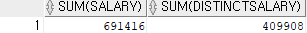
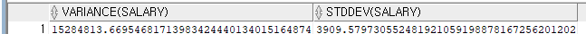
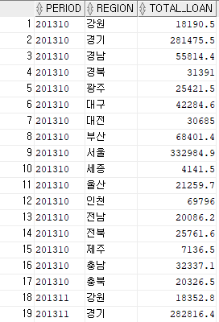
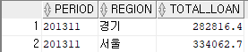
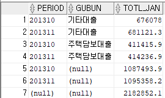
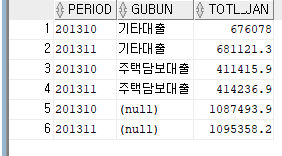
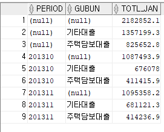
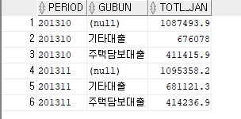

# 그룹 쿼리와 집합 연산자 알아 보기

## 01 기본 집계 함수

1. COUNT(expr)
- 쿼리 결과 건수, 즉 전체 로우 수를 반환하는 집계 함수. 테이블 전체 로우는 물론 WHERE 조건으로 걸러진 로우 수를 반환
```sql
SELECT COUNT(*) FROM employees;
```
- * 대신 컬럼명을 넣을 수도 있다.
- NULL이 아닌 건에 대해서만 로우 수를 반환
```sql
SELECT COUNT(DISTINCT department_id) FROM employees;
```
- DISTINCT는 중복 결과를 제거한다.

2. SUM(expr)
- SUM은 expr의 전체 합계를 반환, expr에는 숫자형만 올 수 있다
```sql
SELECT SUM(salary),SUM(DISTINCT salary) FROM employees;
```


3. AVG(expr)
- AVG는 평군값을 반환

4. MIN(expr), MAX(expr)
- 각각 최소값과 최대값은 반환

5. VARIANCE(expr), STDDEV(expr)
- VARIANCE는 분산
- STDDEV는 표준편차
```sql
SELECT VARIANCE(salary),STDDEV(salary) FROM employees;
```


## 02 GROUP BY 절과 HAVING 절
- GROUP BY 절은 특정 그룹으로 묶어 데이터를 집계 하는 절
- 그룹으로 묶을 컬럼명이나 표현식을 명시 WHERE와 ORDER BY 절 사이에 위치
- 그룹 쿼리를 사용하면 SELECT 리스트에 있는 컬럼명이나 표현식 중 집계 함수를 제외하고는 모두 GROUP BY절에 명시 해야한다.
- 2013년 지역별 가계대출 총 잔액
```sql
SELECT period,REGION,SUM(LOAN_JAN_AMT) TOTAL_LOAN 
    FROM kor_loan_status
    WHERE period LIKE '2013%'
    GROUP BY period,region
    ORDER BY period,region;
```


- HAVING 절은 GROUP BY절 다음에 위치해 GROUP BY한 결과를 대상으로 다시 필터를 건다.
- HAVING 필터 조건 형태로 사용
```sql
SELECT period,REGION,SUM(LOAN_JAN_AMT) TOTAL_LOAN 
    FROM kor_loan_status
    WHERE period = '201311'
    GROUP BY period,region
    HAVING SUM(loan_jan_amt)> 100000
    ORDER BY region;
```


- ORACLE의 쿼리 실행 순서 
- FROM - WHERE - GROUP BY - HAVING - SELECT - ORDER BY

## 03 ROLLUP절과 CUBE 절
- ROLLUP과 CUBE는 GROUP BY절에서 사용되어 그룹별 소계를 추가로 보여주는 역할

- ROLLUP(expr1,expr2,...)
    - expr로 명시한 표현식을 기준으로 집계한 결과, 즉 추가적인 집계 정보를 보여 준다
    - ROLLUP 절의 표현식에는 SELECT 리스트에서 집계 함수를 제외한 컬럼 등의 표현식이 올 수 있으며, 명시한 표현식 수와 순서(오른쪽에서 왼 쪽 순으로)에 따라 레벨별로 집계한 결과가 반환
    ```sql
    SELECT period,gubun,SUM(loan_jan_amt) totl_jan
    FROM kor_loan_status
    WHERE period LIKE '2013%'
    GROUP BY ROLLUP(period,gubun);
    ```
    

    - ROLLLUP 절에 period와 gubun을 명시했으므로 총 레벨 수는 3이다. (3-> 월과 대출종류(period,gubun),2 -> (period), 1 -> 전체 합계가 집계)
    - ROLLUP은 또 다른 유형으로 사용할 수 있다.
    ```sql
    SELECT period,gubun,SUM(loan_jan_amt) totl_jan
    FROM kor_loan_status
    WHERE period LIKE '2013%'
    GROUP BY period, ROLLUP(gubun);
    ```
    - 이렇게 하면 전체 레벨은 2가 되고 2레벨 (period,gubun), (period)가 1레벨로 집계됐다. 이를 분활 ROLLLUP이라고 한다.
    

- CUBE(expr1,expr2,...)
    - CUBE는 명시한 표현식 개수에 따라 가능한 모든 조합별로 집계한 결과를 반환
    - CUBE는 2의 (expr 수) 제곱 만큼 종류별로 집계
    ```sql
    SELECT period,gubun,SUM(loan_jan_amt) totl_jan
    FROM kor_loan_status
    WHERE period LIKE '2013%'
    GROUP BY CUBE(period,gubun);
    ```
    
    - 총 네가지 유형으로 집계, 전체 / 대출 종류별/ 월별 / 월벌 대출 종류별

    - CUBE 역시 분할CUBE를 사용할 수 있다.
    ```sql
    SELECT period,gubun,SUM(loan_jan_amt) totl_jan
    FROM kor_loan_status
    WHERE period LIKE '2013%'
    GROUP BY period, CUBE(gubun);
    ```
    

<table>
    <tr>
        <th>표현식</th>
        <th>집게 종류</th>
    </tr>
    <tr>
        <td rowspan="3">ROLLUP(exrp1,expr2)</td>
        <td>expr1 + expr2</td>
    </tr>
    <tr>
        <td>expr1</td>
    </tr>
    <tr>
        <td>전체</td>
    </tr>
    <tr>
        <td rowspan="3">GROUP BY expr1,ROLLUP(expr2,expr3)
        <td>expr1 + (expr2,expr3)</td>
    </tr>
    <tr>
        <td>expr1  + (expr2)</td>
    </tr>
    <tr>
        <td>expr1</td>
    </tr>
    <tr>
        <td rowspan="2">GROUP BY ROLLUP(expr1),expr2</td>
        <td>expr2 + expr1</td>
    </tr>
    <tr>
        <td>expr2</td>
    </tr>
    <tr>
        <td rowspan="4">CUBE(expr1,expr2)</td>
        <td>expr1 + expr2</td>
    </tr>
    <tr>
        <td>expr1</td>
    </tr>
    <tr>
        <td>expr2</td>
    </tr>
    <tr>
        <td>전체</td>
    </tr>
    <tr>
        <td rowspan="4">GROUP BY expr1,CUBE(expr2,expr3)</td>
        <td>expr1 + (expr2+expr3)</td>
    </tr>
    <tr>
        <td>expr1 + (expr2)</td>
    </tr>
    <tr>
        <td>expr1 + (expr3)</td>
    </tr>
    <tr>
        <td>expr1</td>
    </tr>
</table>

## 04 집합 연산자
- SELECt문을 실행하면 일련의 데이터가 조회되는데, 이 결과를 데이터 집합이라고 부르기도 한다.
- 집합 연산자는 이러한 데이터 집합을 대상으로 연산을 수행하는 연산자
- UNION, UNION ALL, INTERSECT,MINUS가 있다

1. UNION
    - 합집합
    ```sql
    SELECT goods FROM exp_goods_asia WHERE country = '한국'
    UNION
    SELECT goods FROM exp_goods_asia WHERE country ='일본';
    ```
    - 중복되는 건은 한 번만 출력

2. UNION ALL
    - 합집합이지만 중복된 항목도 모두 출력
    ```sql
    SELECT goods FROM exp_goods_asia WHERE country = '한국'
    UNION ALL
    SELECT goods FROM exp_goods_asia WHERE country ='일본';
    ```
3. INTERSECT
    - 교집합
    ```sql
    SELECT goods FROM exp_goods_asia WHERE country = '한국'
    INTERSECT
    SELECT goods FROM exp_goods_asia WHERE country ='일본';
    ```
4. MINUS
    - 차집합
    ```sql
    SELECT goods FROM exp_goods_asia WHERE country = '한국'
    MINUS
    SELECT goods FROM exp_goods_asia WHERE country ='일본';
    ```

### 집합 연산자의 제한사항
1. 집합 연산자로 연결되는 각 SELECT문의 SELECT 리스트의 개수와 데이터 타입은 일치해야 한다
2. 집합 연산자로 SELECT 문을 연결할 때 ORDER BY 절은 맨 마지막 문장에서만 사용할 수 있다
3. BLOB,CLOB,BFILE 타입의 컬럼에 대해서는 집합 연산자를 사용할 수 없다
4. UNION, INTERSECT, MINUS 연산자는 LONG형 컬럼에는 사용할 수 없다

### GROUPING SETS
- ROLLUP이나 CUBE처럼 GROUP BY 절에 명시해서 그룹 쿼리에 사용된다
- UNION ALL의 개념이 포함되어 있다
- GROuPING SETS(expr1,expr2,expr2)은 ((GROUP BY expr1) UNION ALl (GROUP BY expr2) UNION ALL (GROUP BY expr3))의 형태가 된다