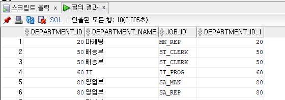
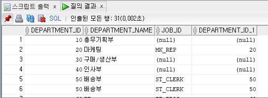

# 테이블 사이를 연결해 주는 ㅗㅈ인과 서브 쿼리 알아 보기

## 01 조인의 종류
- 조인 연산자에 따른 구분 : 동등 조인, 안티 조인
- 조인 대상에 따른 구분 : 셀프 조인
- 조인 조건에 따른 구분 : 내부 조인, 외부 조인, 세미 조인, 카타시안 조인

## 02 내부 조인과 외부 조인
### 동등 조인
- WHERE 절에서 등호('=')연산자를 사용해 2개 이상의 테이블이나 뷰를 연결한 조인
- 이때 WHERE절에 기술한 조건을 조인 조건이라고 한다

```sql
SELECT a.employee_id, a.emp_name,a.department_id,b.department_name
    FROM employees a, departments b
    WHERE a.department_id = b.department_id;
```

### 세미 조인
- 서브 쿼리를 사용해 서브 쿼리에 존재하는 데이터만 메인 쿼리에서 추출하는 방법
- 조인 방법으로 IN과 EXISTS 연산자를 사용한 조인

1. EXISTS 사용
```sql
SELECT department_id, department_name
    FROM departments a
    WHERE EXISTS(SELECT * FROM employees b 
                WHERE a.department_id = b.department_id
                    AND b.salary > 3000)
ORDER BY a.department_name;
```

2. IN 사용
```sql
SELECT department_id, department_name
    FROM departments a
    WHERE a.department_id IN (SELECT b.department_id
                                FROM employees b
                                WHERE b.salary> 3000)
ORDER BY a.department_name;
```

### 안티 조인
- 서브 쿼리의 B 테이블에는 없는 메인 쿼리의 A 테이블의 데이터만 추출하는 조인 방법
- 한쪽 테이블에만 있는 데이터를 추출하는 것이므로 조회 조건에서 NOT IN이나 NOT EXISTS 연산자를 사용
```sql
SELECT a.employee_id, a.emp_name, a.department_id, b.department_name
FROM employees a,
    departments b
WHERE a.department_id = b.department_id
    AND a.department_id NOT IN (SELECT department_id
                                FROM departments
                                WHERE manager_id is NUll);
```

- 위의 쿼리를 NOT EXISTS로도 변환할 수 있다
```sql
SELECT count(*)
    FROM employees a
    WHERE NOT EXISTS(SELECT 1
                        FROM departments c
                        WHERE a.department_id = c.department_id
                            AND manager_id IS NULL);
```

### 셀프 조인
- 동일한 한 테이블을 사용해 조인하는 방법

### 외부 조인
- 조인 조건에 만족하는 데이터 뿐만 아니라 어느 한 쪽 테이블에 조인 조건에 명시된 컬럼에 값이 없거나(NULL 이더라도) 해당 로우가 아예 없더라도 데이터를 모두 추출한다.

1. 일반 조인
```sql
SELECt a.department_id, a.department_name,b.job_id,b.department_id
FROM departments a, job_history b
WHERE a.department_id = b.department_id;
```


2. 외부 조인
```sql
SELECT a.department_id , a.department_name,b.job_id, b.department_id
    FROM departments a,
        job_history b
WHERE a.department_id = b.department_id(+);
```

- 조인 조건에서 데이터가 없는 테이블의 컬럼에 (+) 기호를 붙이는 것이 바로 외부 조인
- 외보 조인은 조건에 해당하는 조인 조건 모두에 (+)를 붙여야 한다.
```sql
SELECt a.employee_id, a.emp_name,b.job_id,b.department_id
FROM employees a,
    job_history b
WHERE a.employee_id = b.employee_id(+)
    and a.department_id = b.department_id(+);
```

- 외부 조인 시 살아야할 내용
    1. 조인 대상 테이블 중 데이터가 없는 테이블 조인 조건에 (+)를 붙인다
    2. 외부 조인의 조인 조건이 여러 개일 때 모든 조건에 (+)를 붙인다
    3. 한 번에 한 테이블에만 외부 조인을 할 수 있다
    4. (+) 연산자가 붙은 조건과 OR를 같이 사용할 수 없다
    5. (+) 연산자가 붙은 조건에는 IN 연산자를 같이 사용할 수 없다(단 IN절에 포함되는 값이 1개인 때는 사용 가능)

### 카타시안 조인
- WHERE 절에 조인 조건이 없는 조인
- 결과는 두 테이블 건수의 곱
```sql
SELECT a.employee_id
    FROM employees a,
        departments b;
```


## 03 ANSI 조인
- ANSI SQL 문법을 사용한 조인
- 지금까지 사용한 조인을 모두 ANSI SQL을 사용해 변환 가능
- 조인 조건이 WHERE이 아닌 FROM 절에 들어 간다

### ANSI 내부 조인
```sql
SELECT *
    FROM employees a INNER JOIN job_history b
    ON a.department_id = b.department_id;
```
```sql
SELECT a.employee_id, a.emp_name, b.department_id,b.department_name
    FROM employees a INNER JOIN departments b
    ON a.department_id = b.department_id
    WHERE a.hire_date >= TO_DATE('20030103','YYYYMMDD');
```

### ANSI 외부 조인
```sql
SELECT a.employee_id, a.emp_name, b.job_id, b.department_id
    FROM employees a LEFT [OUTER] JOIN job_history b
    ON (a.department_id = b.department_id
    AND a.employee_id = b.employee_id);
```
- 외부 조인은 OUTER라는 키워드를 붙이는 데 이는 생략 가능하다

### CROSS 조인
- 카타시안 조인과 동일하다
```sql
SELECT * FROM employees a CROSS JOIN departments b;
```

### FULL OUTER 조인
- ANSI 조인에서만 제공하는 기능

## 04 서브 쿼리
- SQL 문장 안에서 보조로 사용되는 또 다른 SELECT문
- SELECT, FROM, WHERE 절 모두에서 사용할 수 있다. 뿐 아니라, INSERT, UPDATE, MERGE, DELETE 문에서도 사용 할 수 있다

- 특성과 형태에 따른 분류
    - 메인 쿼리와의 연관성에 따라
        - 연관성 없는 서브 쿼리
        - 연관성 있는 서브 쿼리
    - 형태에 따라
        - 일반 서브 쿼리(SELECT 절)
        - 인라인 뷰(FROM 절)
        - 중첩 쿼리(WHERE 절)

### 연관성이 없는 서브 쿼리
```sql
SELECT COUNT(*)
FROM employees
WHERE salary >= (SELECT AVG(salary) FROM employees);

SELECT count(*)
FROM employees
WHERE department_id IN (SELECT department_id FROM departments WHERE parent_id IS NULL);

SELECT employee_id, emp_name, job_id
FROM employees
WHERE (employee_id, job_id) IN(SELECT employee_id,job_id FROM job_history);
```

### 연관성이 있는 서브 쿼리
```sql
SELECt a.department_id, a.department_name
    FROM departments a
WHERE EXISTS (SELECT 1
                FROM job_history b
                WHERE a.department_id = b.department_id);
```

```sql
SELECT a.employee_id,
    (SELECT b.emp_name
        FROM employees b
        WHERE a.employee_id = b.employee_id) AS emp_name,
        a.department_id,
    (SELECT b.department_name
        FROM departments b
        WHERE a.department_id = b.department_id) AS dep_name
FROM job_history a;
```

```sql
SELECT a.department_id, a.department_name
    FROM departments a
WHERE EXISTS (SELECT 1 FROM
                employees b
                WHERE a.department_id = b.department_id
                    AND b.salary > (SELECT AVG(salary) FROM employees)
            );
```

### 인라인 뷰
- FROM 절에 사용 하는 서브 쿼리
```sql
SELECT a.employee_id,a.emp_name, b.department_id, b.department_name FROM employees a,departments b,
        (SELECT AVG(c.salary) AS avg_salary FROM departments b,
                        employees c
            WHERE b.parent_id = 90
            AND b.department_id = c.department_id) d
WHERE a.department_id = b.department_id
    AND a.salary > d.avg_salary;
```

