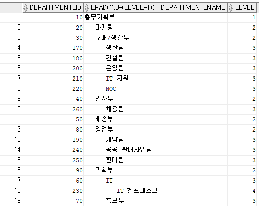
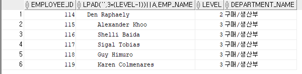
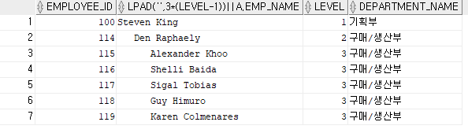
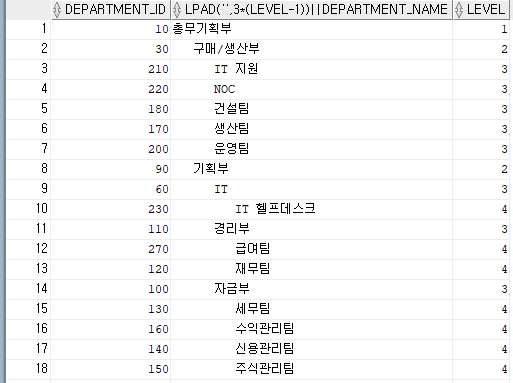
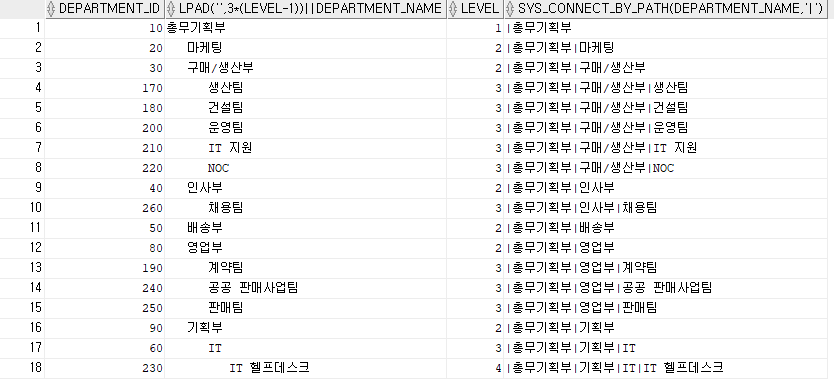

# 복잡한 연산 결과를 추출해 내는 고급 쿼리 다루기
## 01 계층형 쿼리
- 2차원 형태의 테이블에 저장된 데이터를 계층형 구조로 결과를 반환하는 쿼리
```sql
SELECT expr1, expr2, ...
    FROM 테이블
    WHERE 조건
    START WITH[최상위 조건]
CONNECT BY [NOCYCLE][PRIOR 계층형 구조 조건];
```
1. START WITH 조건
    - 계층형 구조에서 최상위 계층의 로우를 식별하는 조건을 명시
2. CONNECT BY 조건
    - 계층형 구조가 어떤 식으로 연결되는지를 기술
    - PRIOR는 계층형 쿼리에서만 사용할 수 있는 연산자

```sql
SELECT department_id,LPAD(' ',3*(LEVEL - 1)) || department_name, LEVEL
    FROM departments
    START WITH parent_id is NULL
    CONNECT BY PRIOR department_id = parent_id;
```


- 일반 조건은 WHERE 절 / 계층형 쿼리에 대한 필터 조건은 CONNECT BY 절에 기술
```sql
SELECT a.employee_id, LPAD(' ',3*(LEVEL -1)) || a.emp_name, LEVEL, b.department_name
    FROM employees a,
        departments b
    WHERE a.department_id = b.department_id
    AND a.department_id = 30
    START WITH a.manager_id is NULL
    CONNECT BY NOCYCLE PRIOR a.employee_id = a.manager_id;
    
SELECT a.employee_id, LPAD(' ',3*(LEVEL -1)) || a.emp_name, LEVEL, b.department_name
    FROM employees a,
        departments b
    WHERE a.department_id = b.department_id
    START WITH a.manager_id is NULL
    CONNECT BY NOCYCLE PRIOR a.employee_id = a.manager_id
                AND a.department_id = 30;
```




- 내부적 처리 절차
    1. 조인이 있으면 조인을 먼저 처리한다
    2. START WITH 절을 참조해 최상위 계층 로우를 선택한다
    3. CONNECT BY 절에 명시된 구문에 따라 계층형 관계를 파악해 자식 로우를 차례로 선택한다. 최상위 로우를 기준으로 자식 로우를 선택하고 이 자식 로우에 대한 또 다른 자식 로우가 있으면 선택하는 식으로 계선 조건에 맞는 로우를 찾는다
    4. 자식 로우 찾기가 끝나면 조인을 제외한 WHERE 조건에 해당하는 로우를 걸러내는데, 로우별로 조건에 맞지 않는 건을 걸러낸다.

### 계층형 쿼리 심화학습
1. 계층형 쿼리 정렬
    - ORDER BY 절로 그 순서를 변경할 수 있다
    ```sql
    SELECT department_id,LPAD(' ',3*(LEVEL - 1)) || department_name, LEVEL
    FROM departments
    START WITH parent_id is NULL
    CONNECT BY PRIOR department_id = parent_id
    ORDER BY department_name;
    ```
    - 계층형 구조까지 보존하려면 ORDER SIBLINGS BY 절을 사용해야 한다.
    ```sql
    SELECT department_id,LPAD(' ',3*(LEVEL - 1)) || department_name, LEVEL
    FROM departments
    START WITH parent_id is NULL
    CONNECT BY PRIOR department_id = parent_id
    ORDER SIBLINGS BY  department_name;                
    ```

    

2. CONNECT_BY_ROOT
    - 계층형 쿼리에서 최상위 로우를 반환하는 연산자
    - 연산자이므로 다음에 표현식이 온다
    ```sql
    SELECT department_id,LPAD(' ',3*(LEVEL - 1)) || department_name, LEVEL
    , CONNECT_BY_ROOT department_name AS ROOT_NAME
    FROM departments
    START WITH parent_id is NULL
    CONNECT BY PRIOR department_id = parent_id
    ```

3. CONNECT_BY_ISLEAF
    - CONNECT BY 조건에 정의된 관계에 따라 해당 로우가 최하위 자식 로우면 1을 그렇지 않으면 0을 반환하는 의사 컬럼
    ```sql
    SELECT department_id,LPAD(' ',3*(LEVEL - 1)) || department_name, LEVEL
    , CONNECT_BY_ISLEAF
    FROM departments
    START WITH parent_id is NULL
    CONNECT BY PRIOR department_id = parent_id
    ```

    

4. SYS_CONNECT_BY_PATH(colm,char)
    - 계층형 쿼리에서만 사용할 수 있는 함수
    - 루트 노드에서 시작해 자신의 행까지 연결된 경로 정보를 반환
    - 첫 번째 파라미터로 컬럼이 두 번째 파라미터로 컬럼 간 구분자를 의미
    ```sql
    SELECT department_id,LPAD(' ',3*(LEVEL - 1)) || department_name, LEVEL
    , SYS_CONNECT_BY_PATH(department_name,'|')
    FROM departments
    START WITH parent_id is NULL
    CONNECT BY PRIOR department_id = parent_id
    ```
    

    - **해당 컬럼 값에 포함된 문자는 사용할 수 없다**
5. CONNECT_BY_ISCYCLE
    - 오라클의 계층형 쿼리는 루프(반복) 알고리즘을 사용
    - 조건을 잘못 주면 무한루프를 타게 된다
    - 이때 발생 원인을 찾아 데이터를 수정해야하는 데 CONNECT BY 절에 NOCYTCLE을 추가하고 SELECT 절에 CONNECT_BY_ISCYCLE 의사 컬럼을 사용해 찾을 수 있다
    - 현재 로우가 자식을 갖고 있는데 동시에 그 자식 로우가 부모 로우이면 1을, 그렇지 않으면 0을 반환한다.

### 계층형 쿼리 응용