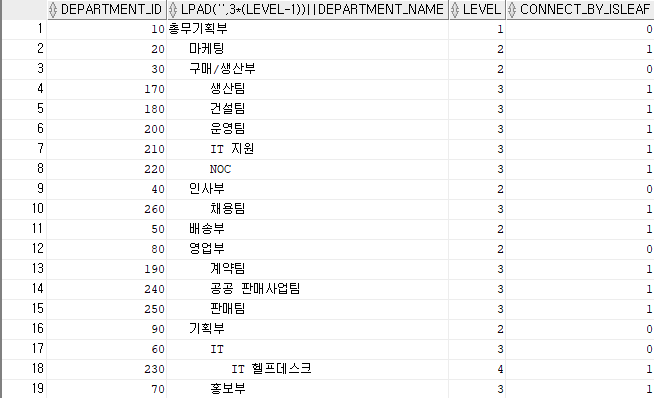

# 복잡한 연산 결과를 추출해 내는 고급 쿼리 다루기
## 01 계층형 쿼리
- 2차원 형태의 테이블에 저장된 데이터를 계층형 구조로 결과를 반환하는 쿼리
```sql
SELECT expr1, expr2, ...
    FROM 테이블
    WHERE 조건
    START WITH[최상위 조건]
CONNECT BY [NOCYCLE][PRIOR 계층형 구조 조건];
```
1. START WITH 조건
    - 계층형 구조에서 최상위 계층의 로우를 식별하는 조건을 명시
2. CONNECT BY 조건
    - 계층형 구조가 어떤 식으로 연결되는지를 기술
    - PRIOR는 계층형 쿼리에서만 사용할 수 있는 연산자

```sql
SELECT department_id,LPAD(' ',3*(LEVEL - 1)) || department_name, LEVEL
    FROM departments
    START WITH parent_id is NULL
    CONNECT BY PRIOR department_id = parent_id;
```


- 일반 조건은 WHERE 절 / 계층형 쿼리에 대한 필터 조건은 CONNECT BY 절에 기술
```sql
SELECT a.employee_id, LPAD(' ',3*(LEVEL -1)) || a.emp_name, LEVEL, b.department_name
    FROM employees a,
        departments b
    WHERE a.department_id = b.department_id
    AND a.department_id = 30
    START WITH a.manager_id is NULL
    CONNECT BY NOCYCLE PRIOR a.employee_id = a.manager_id;
    
SELECT a.employee_id, LPAD(' ',3*(LEVEL -1)) || a.emp_name, LEVEL, b.department_name
    FROM employees a,
        departments b
    WHERE a.department_id = b.department_id
    START WITH a.manager_id is NULL
    CONNECT BY NOCYCLE PRIOR a.employee_id = a.manager_id
                AND a.department_id = 30;
```


- 내부적 처리 절차
    1. 조인이 있으면 조인을 먼저 처리한다
    2. START WITH 절을 참조해 최상위 계층 로우를 선택한다
    3. CONNECT BY 절에 명시된 구문에 따라 계층형 관계를 파악해 자식 로우를 차례로 선택한다. 최상위 로우를 기준으로 자식 로우를 선택하고 이 자식 로우에 대한 또 다른 자식 로우가 있으면 선택하는 식으로 계선 조건에 맞는 로우를 찾는다
    4. 자식 로우 찾기가 끝나면 조인을 제외한 WHERE 조건에 해당하는 로우를 걸러내는데, 로우별로 조건에 맞지 않는 건을 걸러낸다.

### 계층형 쿼리 심화학습
1. 계층형 쿼리 정렬
    - ORDER BY 절로 그 순서를 변경할 수 있다
    ```sql
    SELECT department_id,LPAD(' ',3*(LEVEL - 1)) || department_name, LEVEL
    FROM departments
    START WITH parent_id is NULL
    CONNECT BY PRIOR department_id = parent_id
    ORDER BY department_name;
    ```
    - 계층형 구조까지 보존하려면 ORDER SIBLINGS BY 절을 사용해야 한다.
    ```sql
    SELECT department_id,LPAD(' ',3*(LEVEL - 1)) || department_name, LEVEL
    FROM departments
    START WITH parent_id is NULL
    CONNECT BY PRIOR department_id = parent_id
    ORDER SIBLINGS BY  department_name;                
    ```

    

2. CONNECT_BY_ROOT
    - 계층형 쿼리에서 최상위 로우를 반환하는 연산자
    - 연산자이므로 다음에 표현식이 온다
    ```sql
    SELECT department_id,LPAD(' ',3*(LEVEL - 1)) || department_name, LEVEL
    , CONNECT_BY_ROOT department_name AS ROOT_NAME
    FROM departments
    START WITH parent_id is NULL
    CONNECT BY PRIOR department_id = parent_id
    ```

3. CONNECT_BY_ISLEAF
    - CONNECT BY 조건에 정의된 관계에 따라 해당 로우가 최하위 자식 로우면 1을 그렇지 않으면 0을 반환하는 의사 컬럼
    ```sql
    SELECT department_id,LPAD(' ',3*(LEVEL - 1)) || department_name, LEVEL
    , CONNECT_BY_ISLEAF
    FROM departments
    START WITH parent_id is NULL
    CONNECT BY PRIOR department_id = parent_id
    ```

    

4. SYS_CONNECT_BY_PATH(colm,char)
    - 계층형 쿼리에서만 사용할 수 있는 함수
    - 루트 노드에서 시작해 자신의 행까지 연결된 경로 정보를 반환
    - 첫 번째 파라미터로 컬럼이 두 번째 파라미터로 컬럼 간 구분자를 의미
    ```sql
    SELECT department_id,LPAD(' ',3*(LEVEL - 1)) || department_name, LEVEL
    , SYS_CONNECT_BY_PATH(department_name,'|')
    FROM departments
    START WITH parent_id is NULL
    CONNECT BY PRIOR department_id = parent_id
    ```
    

    - **해당 컬럼 값에 포함된 문자는 사용할 수 없다**
5. CONNECT_BY_ISCYCLE
    - 오라클의 계층형 쿼리는 루프(반복) 알고리즘을 사용
    - 조건을 잘못 주면 무한루프를 타게 된다
    - 이때 발생 원인을 찾아 데이터를 수정해야하는 데 CONNECT BY 절에 NOCYTCLE을 추가하고 SELECT 절에 CONNECT_BY_ISCYCLE 의사 컬럼을 사용해 찾을 수 있다
    - 현재 로우가 자식을 갖고 있는데 동시에 그 자식 로우가 부모 로우이면 1을, 그렇지 않으면 0을 반환한다.

### 계층형 쿼리 응용

1. 샘플 데이터 생성
```sql
CREATE TABLE ex7_1 AS
SELECT ROWNUM seq,
    '2014' || LPAD(CEIL(ROWNUM/1000),2,'0') month,
    ROUND(DBMS_RANDOM.VALUE(100,1000)) amt
FROM DUAL
CONNECT BY LEVEL <= 12000;
```

2. 로우를 컬럼으로 변환하기
```sql
LISTAGG(expr,delimiter) WITHIN GROUP(ORDER BY 절)
```
- expr을 delimiter로 구분해서 로우를 컬럼으로 변환해주는 조회 함수
```sql
CREATE TABLE ex7_2 AS
SELECT department_id,
    LISTAGG(emp_name,',') WITHIN GROUP (ORDER BY emp_name) as empnames
    FROM employees
    WHERE department_id IS NOT NULL
    GROUP BY department_id;
```


3. 컬럼을 로우로 변환하기
```sql
SELECT REPLACE(SUBSTR(empnames,start_pos,end_pos - start_pos),',','') AS emp
    FROM (SELECT empnames,
    DECODE(level,1,1,INSTR(empnames,',',1,LEVEL-1)) start_pos,
    INSTR(empnames,',',1,LEVEL) end_pos,
        LEVEL as lvl
    FROM (SELECT empnames || ',' AS empnames,
                LENGTH(empnames) ori_len,
                LENGTH(REPLACE(empnames,',','')) new_len
            FROM ex7_2
            WHERE department_id = 90
            )
    CONNECT BY LEVEL <= ori_len - new_len +1
    );
```


## 02 WITH 절

### 개선된 서브쿼리
```sql
WITH 별칭1 AS (SELECT 문),
     별칭2 AS (SELECT 문)
...
SELECT
    FROM 별칭1, 별칭2
```

```sql
WITH b2 AS (SELECT period, region, sum(loan_jan_amt) jan_amt
                FROM kor_loan_status
                GROUP BY period,region),
    c AS ( SELECT b2.period, MAX(b2.jan_amt) max_jan_amt
            FROM b2,
            (SELECT MAX(PERIOD) max_month
                FROM kor_loan_status
                GROUP BY SUBSTR(PERIOD,1,4)
                ) a
            WHERE b2.period = a.max_month
            GROUP BY b2.period
            )
SELECT b2.*
FROM b2,c
WHERE b2.period = c.period
AND b2.jan_amt = c.max_jan_amt
ORDER BY 1;
```

### 순환 서브 쿼리
- 오라클 11gR2 버전부터 WITH 절로 순환 쿼리 사용이 가능하다
- 순환 서브 쿼리란 계층형 쿼리와 개념이 같다

## 03 분석 함수와 window 함수

- 분석 함수란 테이블에 있는 로우에 대해 특정 그룹별로 집계 값을 산출할 때 사용 된다
- 분석 함수에서 사용하는 로우별 그룹을 윈도우라고 하는데 이는 집계 값 ㅖ산을 위한 로우의 범위를 결정하는 역할ㅇ르 한다

```sql
분석 함수(매개변수) OVER
    (PARTITION BY expr1,expr2,...
        ORDER BY expr3, expr4...
        window 절)
```

- 분석 함수 : 특정 그룹별 집계를 담당하므로 집계 함수에 속한다
- PARTITION BY 절 : 분석 함수로 계산될 대상 로우의 그룹(파티션)을 지정한다
- ORDER BY 절 : 파티션 안에서의 순서를 지정한다
- WINDOW 절 : 파티션으로 분할된 그룹에 대해서 더 상세한 그룹으로 분할할 때 사용된다

### 분석 함수
1. ROW_NUMBER()
    - ROWNUM 의사 컬럼과 비슷한 기능을 하는데, 파티션으로 분할된 그룹별로 각 로우에 대한 순번을 반환하는 함수

2. RANK(),DENSE_RANK()
    - RANK 함수는 파티션별 순위를 반환
    - DENSE_RANK 함수는 RANK와 비슷하지만 같은 순위가 나오면 다음 순위가 한 번 건너뛰지 않고 매겨진다

3. CUME_DIST()와 PERCENT_RANK()
    - CUME_DIST 함수는 주어진 그룹에 대한 상대적인 누적분포도 값을 반환
    - PERCENT_RANK 함수는 해당 그룹 내의 백분위 순위를 반환

4. NTILE(expr)
    - 파티션별로 expr에 명시된 값만큼 분할한 결과를 반환

5. LAG(expr,offset,default_value), LEAD(expr,offset,default_value)

### window 절

```sql
{ ROWS | RANGE}
    {BETWEEN {UNBOUNDED PRECENDING
                | CURRENT ROW
                | value_expr{PRECENDING + FOLLOWING}
                }
            AND{ UNBOUNDED FOLLOWING
                | CURRENT ROW
                | value_expr{PRECENDING | FOLLOWING}
            }
        | { UNBOUNDED PRECENDING
            | CURRENT ROW
            | value_expr PRECENDING}
    }
            
```

### window 함수
- 모든 분석 함수를 window 절과 함께 사용할 수 있는 것은 아니다
- AVG,CORR,COUNT,FIRST_VALUE,LAST_VALUE,MAX,MIN,MTH_VALUE,STDDEV,SUM,VARIANCE 등의 함수만 window 절과 함께 사용할 수 있다.

1. FIRST_VALUE(expr)와 LAST_VALUE(expr)

2. NTH_VALUE(measure_expr,n)
- 주어진 그룹에서 n번째 로우에 해당하는 measure_expr 값을 반환한다.

### 기타분석 함수
1. WIDTH_BUCKET(expr, min_value,max_value,num_buckets)
- NTILE 함수와 용도가 비슷하다
- NTILE처럼 분할 결과를 반환하는데 다른 점은 expr 값에 따라 최솟값 최댓값을 주어 num_buckets 만큼 분할한다.

2. FIRST와 LAST
- 집계 함수와 같이 사용되어 주어진 그룹에 대해 내부적으로 순위를 매겨 결과를 산출하는 함수

```sql
WITH basis AS (
    SELECT period, region, SUM(loan_jan_amt) jan_amt
    FROM kor_loan_status
    GROUP BY period, region
)
SELECT a.period,
    MIN(a.region) KEEP ( DENSE_RANK FIRST ORDER BY jan_amt) "최소지역",
    MIN(jan_amt) "최소금액",
    MAX(a.region) KEEP( DENSE_RANK LAST ORDER BY jan_amt) "최대지역",
    MAX(jan_amt) "최대금액"
    FROM basis a
    GROup BY a.period
    ORDER BY 1,2;
```

3. RATIO_TO_REPORT(expr)
- 주어진 그룹에 대해 expr 값의 합을 기준으로 각 로우의 상대적 비율을 반환 한다.

## 04 다중 테이블 INSERT
```sql
INSERT ALL | FIRST
WHEN 조건1 THEN
INTO [스키마.]테이블명(컬럼1,컬럼2,...) VALUES(값1,값2,...)
WHEN 조건2 THEN
INTO [스키마.]테이블명(컬럼1,컬럼2,...) VALUES(값1,값2,...)
    ...
ELSE
INTO [스키마.]테이블명(컬럼1,컬럼2,...) VALUES(값1,값2,...)
SELEECT 문;
```